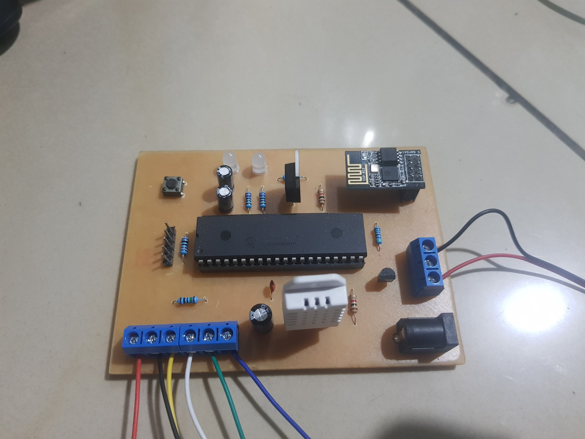
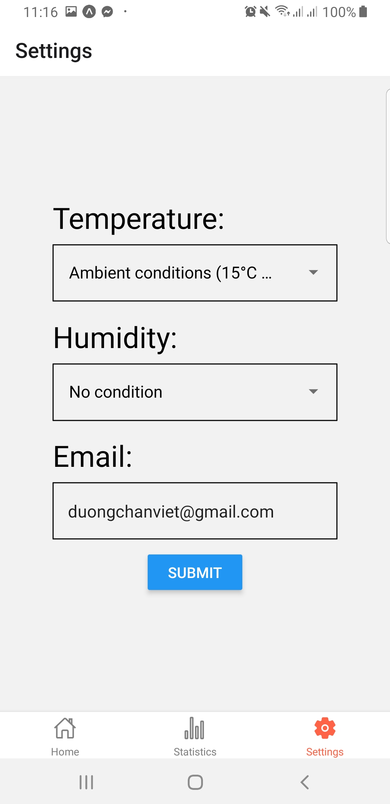
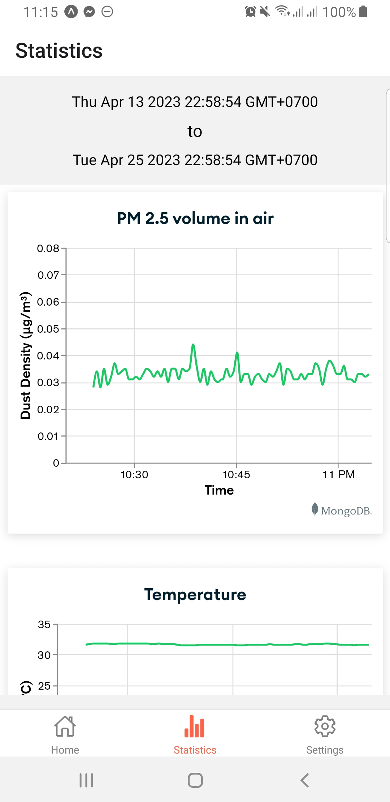
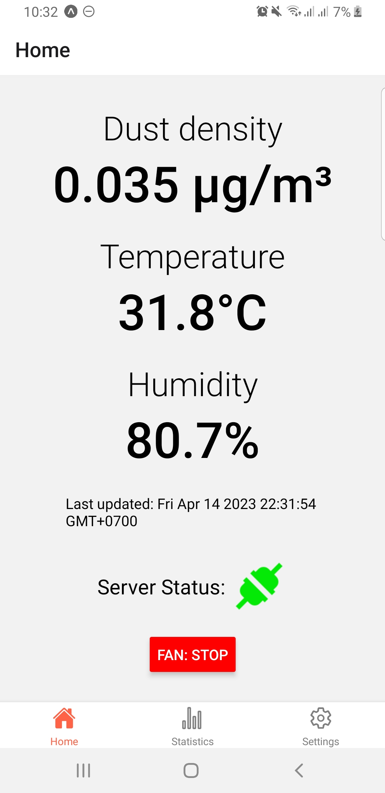

# temp-hum-dust-monitoring-controlling

First uni project: Temperature, humidity and dust density monitoring and controlling system.
This system includes:
- Monitoring and controlling board using PIC microcontroller [code](/code) [schematic](/schematic)
- [React Native app](/app)
- [Node-RED server](/node-red)

## Screenshots:

